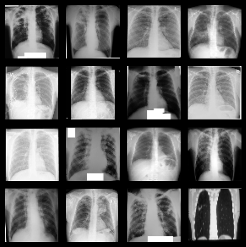
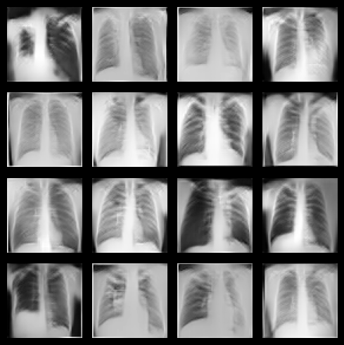
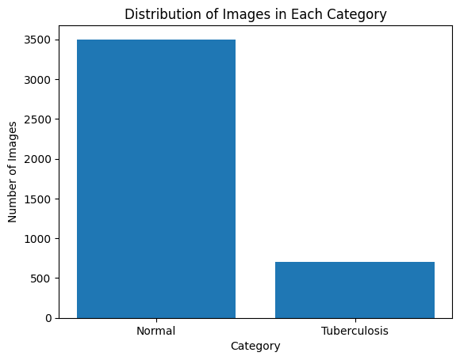
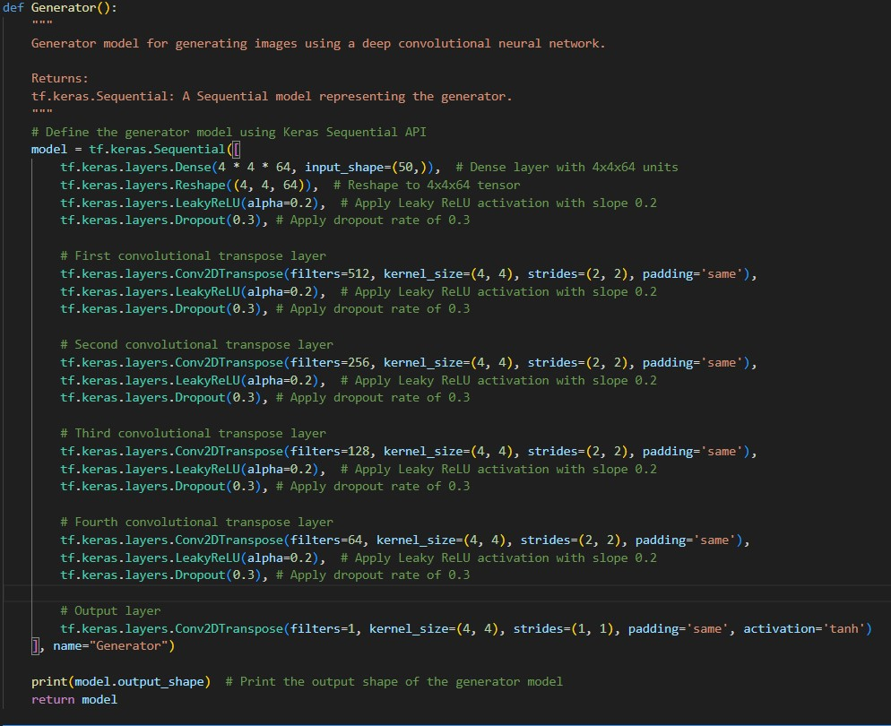
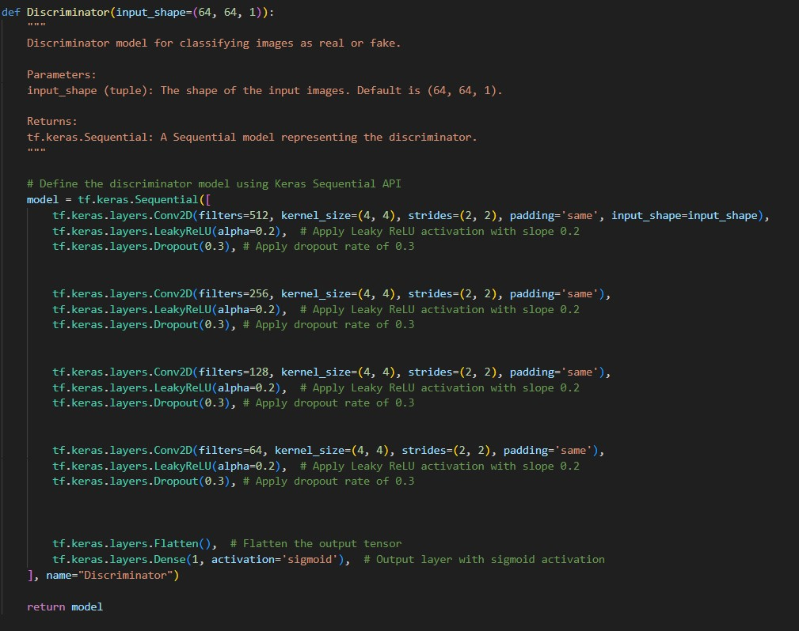

## Overview

In the field of medical imaging, certain conditions or diagnoses are underrepresented in available datasets.
This leads to challenges in developing robust models for these minority classes.
The importance of balanced datasets in training machine learning models, especially in healthcare applications, cannot be overstated.
This project aims to address the scarcity of medical images for a specific minority class, 'Diagnosed with Tuberculosis,' by leveraging the power of Deep Convolutional Generative Adversarial Networks (DCGANs).
## Built with

## Statement
Tuberculosis (TB) and Pneumonia are significant public health concerns, and the accurate diagnosis of these diseases through medical imaging, particularly chest X-rays, is pivotal for timely intervention. However, the challenge lies in the inherent data imbalance within medical datasets, where instances of TB and Pneumonia are often underrepresented compared to normal cases.
The existing dataset for TB and Pneumonia classification exhibits a pronounced imbalance,
leading to suboptimal performance of machine learning models.
Conventional approaches struggle to generalize effectively due to the scarcity of data for certain classes, hindering the development of robust diagnostic tools.

The primary goal of this project is to use Deep Convolutional Generative Adversarial Networks (DCGANs) to generate realistic and diverse medical images specifically related to the Tuberculosis class.
By synthesizing additional data, we aim to augment the existing dataset and,
improve the performance of diagnostic models, addressing the challenges posed by data imbalance.
<h3 align ="center">Images from a batch of  the Original Dataset (Left) VS a batch of Generated by the DCGAN (Right)</h3>

  
  
  

## Project Scope
- Develop a DCGAN using TensorFlow and Keras for generating synthetic medical images.
- Achieve high quality of Generated images by training an accurate Generator using Adversarial training.
- Augment the original medical dataset by creating more than 2800 images  to address the imbalance in Tuberculosis class compared to Normal class.
- Ensure Increased diversity in the dataset for the 'Diagnosed' class,
- Build a Streamlit app to enable the real time generation of images of the Tuberculosis Class by entering a number of images

## Dataset
The Original Dataset contains 3500 Images of class Normal & 700 Images of Class Tuberculosis.

Which mean that the Tuberculosis or also Diagnosed Class has a ration of 1 to 5 to the Normal Class.
This situation affects the performance of Computer Vision Models and gives favor to the Majority Class.

It comes from <a>https://www.kaggle.com/datasets/tawsifurrahman/tuberculosis-tb-chest-xray-dataset</a>

<h3 align="center">We can view a clear Imbalanced Distribution of the Images</h3>

  

## Model Training & Results

<h3 align="center">Generator Architecture</h3>

  

<h3 align="center">Discriminator Architecture</h3>

  

- Images were preprocessed through resizing, normalization & conversion to grayscale.
- A batched tf dataset was created to ensure fast computations.
- The Generator & Discriminator Architectures were designed taking into consideration the dataset structure and the Adversarial training features.
- Experimentation with different Layers, activation, filters and initializers, in addition to regularization were applied.
- The Model was trained using an Adam optimizer with 0.00001 learning rate, for 2000 epochs with a batch size of 64.
- The best model was chosen based on Visual Inspection primarily & how close is the generated image to real images.
## Output
- An example of the Generated Images is shown in the Repo under directory /Generated/
- The final models are saved under /Models/
- Under /utils/ you can find a notebook to visualize batches from both Original & Generated Dataset.
- The streamlit app for real time generation is available under: <a>https://datasetgeneration.streamlit.app/</a>

## Contact
 Feel free to reach out to me on LinkedIn or through email & don't forget to visit my portfolio.
 
  
  
  
